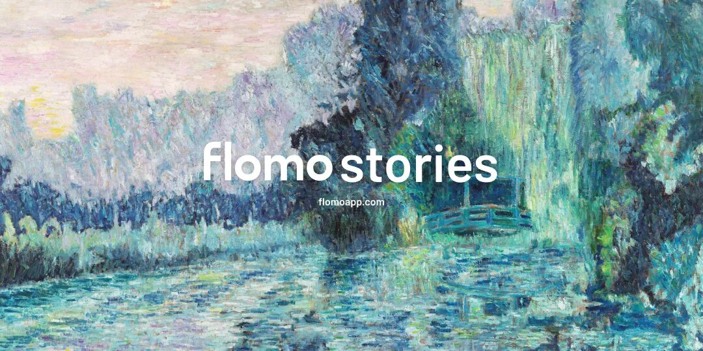
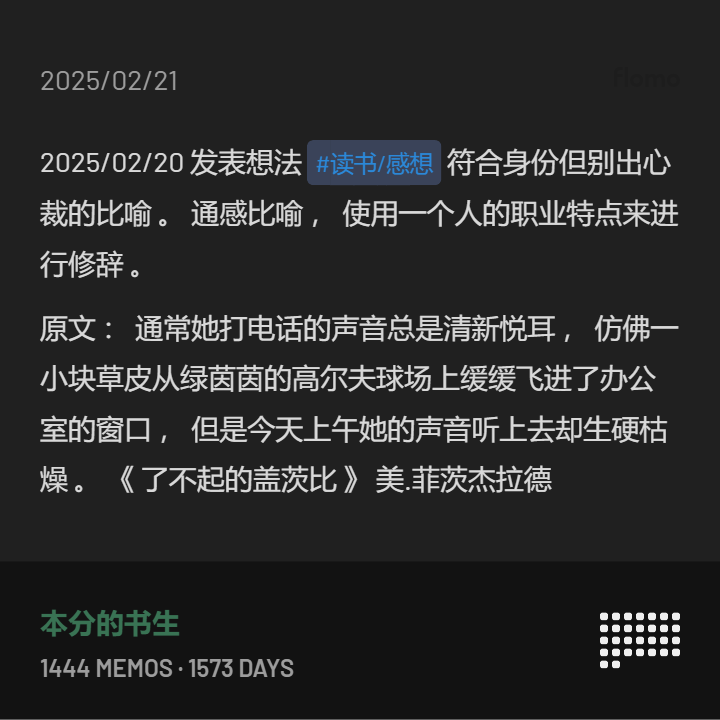
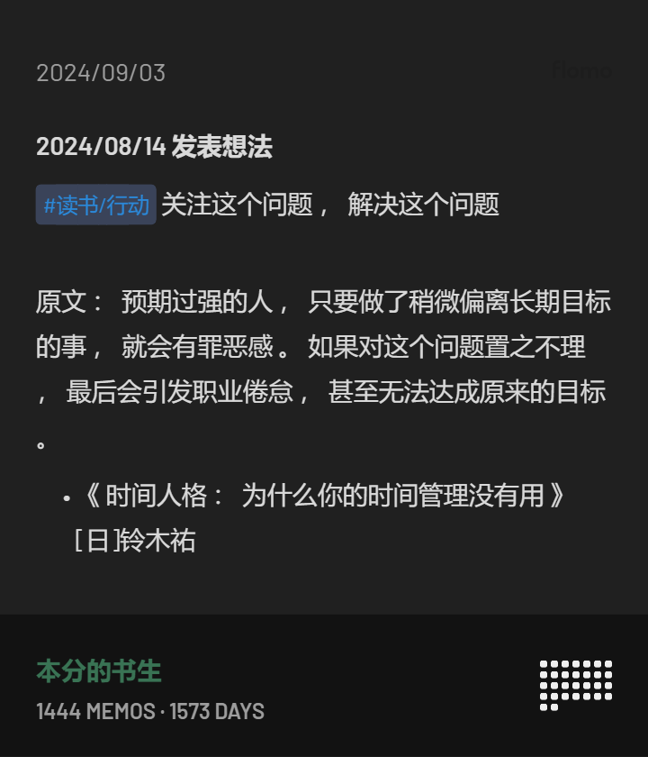
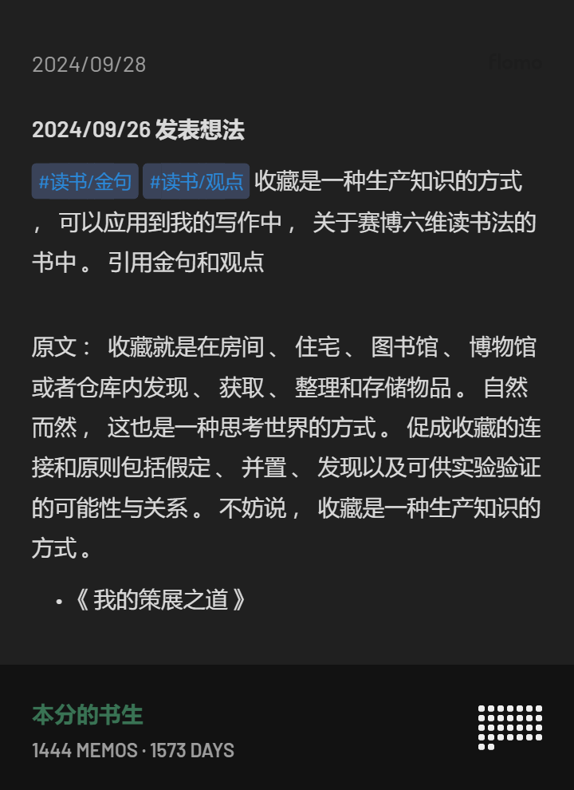
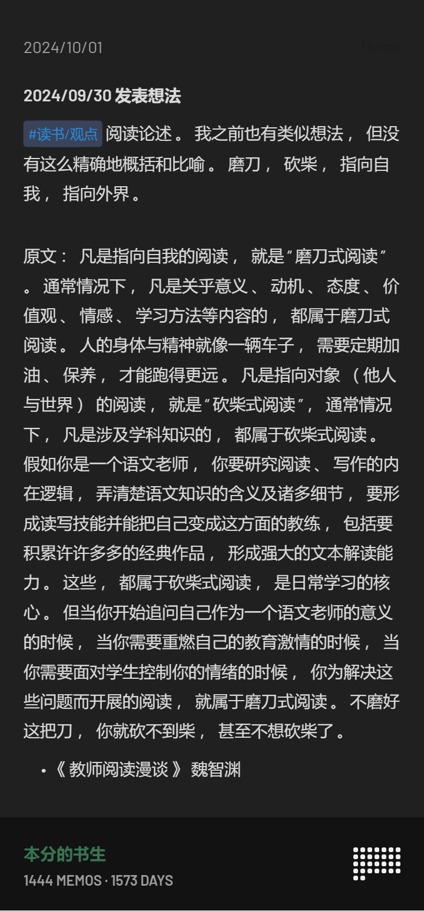
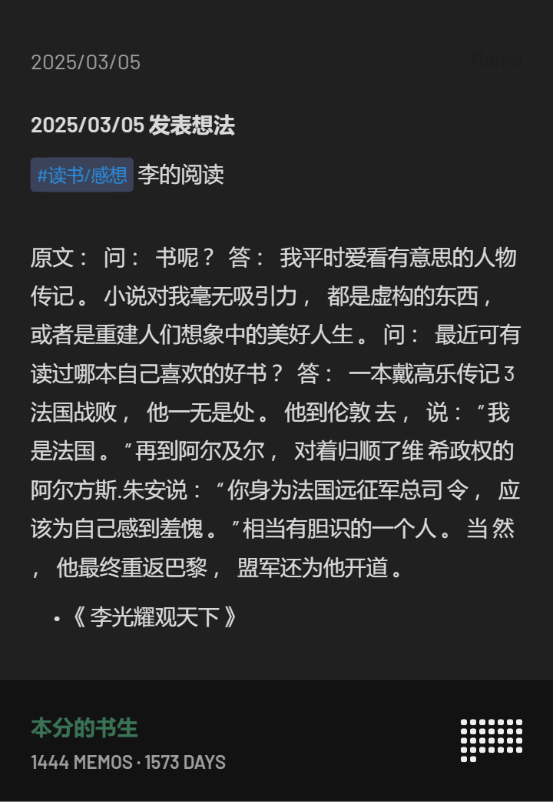
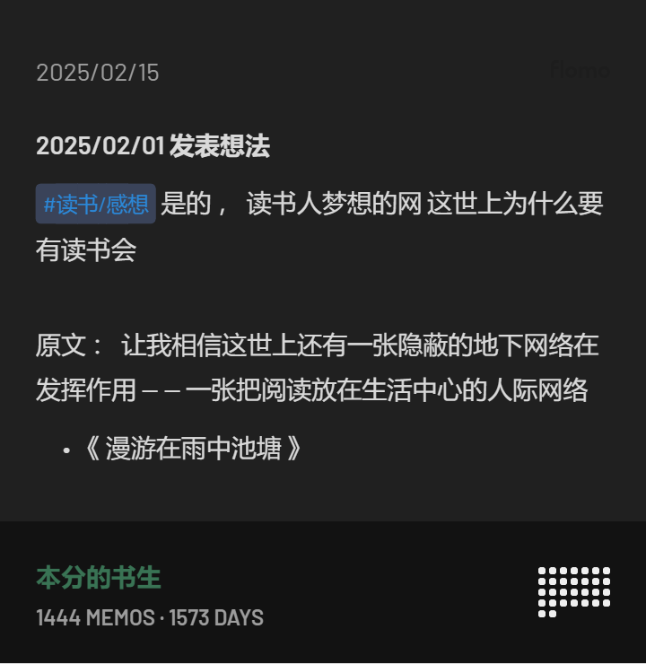

# 【flomo实践】用这 6 个标签，让读书笔记不再只是划线

> 公众号: flomo浮墨笔记
> 发布时间: 2025年4月9日 20:00
> 原文链接: https://mp.weixin.qq.com/s/Rt-xK8dBxybsCgQIgBaDxw

---

阅读的意义，不止在当下的感动，更在未来能被唤起、被使用。但很多时候，我们读完一本书，难以内化成为自己的知识，也无法转化为行动。

这一次，我们邀请了@本分的书生 来分享他这一年用 flomo 实践的“六维读书法”——不是堆砌读书量，而是让每一条读书笔记都能派上用场，像积木一样，构建起自己的第二大脑。

希望这篇文章，能让你的读书笔记，也重新“活”起来。enjoy～

【直播预告📺】：下周就是 flomo 5 岁生日啦，五周年之际我们决定做一件有点冒险又有趣的尝试，@少楠 会在直播中和你唠唠嗑，分享一个全新的计划及背后的思考与设计。

欢迎对“AI +个人笔记”感兴趣的你预约，一起在 AI 时代重新发现记录的意义，下周三见！

你好，我是本分的书生，一枚商业策划，同时也是一位深度的阅读爱好者、亲子阅读的实践者，目前主要关注在：阅读、写作、知识管理、策划四个方面。

从去年开始，我摸索并实践了一套阅读笔记方法，并主要使用 flomo 来承载。

这个方法最大的改变，是让我看过的读书笔记“活”了起来，可以随时调用，整理笔记的效率也大大提升。一年下来，我轻松写下了 50 多篇书评，这些读书笔记也像养分一样，持续滋养着我的思考与创作。

能做到这样，也是一步步摸索出来的，并不是一上来就做得井井有条。如果你也和我曾经一样：读书时觉得收获满满，可过段时间再想，脑子里却空空如也，能清晰记起来的寥寥无几，更别说应用到工作和生活中。

那么现在恭喜你，可以直接拿去用这套读书记笔记的方法，我称之为：六维读书法，通过六个标签，可以帮你更高效的做读书笔记，减少囤积很多用不上的读书划线。

在分享这套方法前，先来分享一下，我做读书笔记经历过的三个阶段，可能大多数人跟我一样都经历过或者正在经历。

**1、如何走出阅读无效区？**

**阶段一：只读不记，读的越多忘的越多。**

很多热爱阅读的人，都会有许多年的阅读经验，并且大多数人也喜欢以读过书的数量和阅读时长来衡量自己阅读质量，但时长长未必等于收获多。

不是有句话说的好：“你读过的书，走过的路，最终都会融进你的气质里。”实际上呢，读的时候感觉懂了也明白了，但时间一长基本上忘的一干二净。

我曾在一次线下读书会分享时，上台前信心满满，站台上发现脑子里却只能搜刮出最近读的两三本书的内容，之前的积累仿佛从未发生，不是书到用时方恨少，而是压根就想不起来自己读过啥啊，于是痛定思痛，我开始做笔记。

**阶段二：只记不看，笔记成了“收藏品”。**

于是，每次读书看到精彩的修辞、精妙的比喻、感同身受的描述、别出机杼的观点，恨不得划线数十次，都摘抄起来。

但很快发现新问题：笔记越记越多，查找和回顾变得越来越难。每次想整理，面对堆积如山的笔记都感到压力山大，管理成本甚至超过了记笔记的乐趣，渐渐地这些笔记就成了只进不出的“收藏品”。

此时，就进入了「笔记之死」的状态，许多人弃用某些笔记，并不是笔记工具出了问题，而是想找个新的工具重新开始。

**阶段三：边读边记、即时整理，让笔记“活”起来。**

直到我开始使用 flomo并结合自己摸索的原则，才真正进入了这个高效阶段。

flomo 的好处在于标签足够轻便灵活，加上卡片本身的结构让人压力不大，配合自己构建的读书笔记“三原则”和“六标签”，管理上千条笔记毫无压力。

**2、高效记笔记“三原则”与“六标签”**

**原则一：凡标记，必批注——记录你“心动”的瞬间**

就像之前，读书时看到某个精彩段落，激动地划线、加粗、标亮，但过阵子再看，完全忘了当时为啥如此激动，甚至觉得不过如此？

这就是因为我们只标记了“是什么”，却忘了记录“为什么”。

所以，我的第一个原则是：**只要做了标记（划线、摘抄），就必须加上批注，用自己的话说明白：此刻为什么被触动？它让我想到了什么？有什么启发？**

以我的这条笔记为例，这是菲茨杰拉德的《了不起的盖茨比》中的一段话。

菲茨杰拉德的文笔生动，尤其擅长比喻，值得借鉴。这段话里，他把女朋友乔丹·贝克的来电，比作高尔夫球场的草皮飞进办公室。妙就妙在，乔丹·贝克本就是一名高尔夫运动员。我们描写声音时常用声音作比，如“小鸟叽叽喳喳”，而菲茨杰拉德的写法却别出心裁。

如果是以前，我看到这个句子好，会标记下来，但过段时间看，就忘记了自己为什么要标注这个句子。现在，我能快速的回顾这句子哪里打动我了、我能从中借鉴什么技巧和快速的调用这个句子，一举三得。

加上批注，这条笔记就从简单的摘抄，变成了包含个人思考和行动指引的“活”知识。

**原则二：笔记集中化——打造可检索的“第二大脑”**

纸质笔记、阅读APP内置笔记、微信收藏……笔记散落在各处，等于没有笔记。想找某个知识点？简直是大海捞针。

所以，第二个原则是：**所有的阅读笔记，无论来源如何，最终都要汇总到一个统一的、易于检索的平台。**

我选择了 flomo，因为它足够轻快，支持多平台同步，而且强大的标签和搜索功能让查找变得轻而易举。当然，你也可以选择其他你用得顺手的工具，关键是集中管理。

**原则三：即时分类——阅读时就完成80%的整理工作**

以前，我看完一本书，需要花一两个小时把几十条笔记导出、回顾、整理、打标签。这个过程虽然有价值，但也带来了巨大的整理负担，让人想要逃避。

于是，我确立了第三个原则：**在阅读并记录批注的那一刻，就为笔记打上预设的标签，完成初步分类。**

为了方便后续回顾和应用，我设定了六个常用的标签，覆盖了阅读笔记的绝大多数场景：

**第一大类 ：以“我”为中心，记录我的思考与行动。**

主要有这三个标签：

-   #感想：阅读时的所思所想，哪怕是零碎的、口语化的，帮助自己回顾当时的思考路径。

-   #行动：读完后想要去实践的具体步骤，最好符合SMART原则，提醒自己去执行。

-   #问题：阅读中产生的疑问，记录下来，督促自己去寻找答案。

上面这条笔记的问题，以行动标签记录下来。所有重要的、后面需要行动的都以这个标签记录，行动标签只记录自己需要行动的，数量少，但一定带动行动，来解决自身的问题或精进某一项技能。

**第二大类 ：以“书”为中心，记录文本的价值与启发。**

主要有这三个标签：

-   #知识：书中明确的、重要的、与我相关的知识点、概念或事实。

-   #金句：触动我、想记住、想引用的优美或精辟句子。

-   #观点：书中提出的有趣或有启发的观点，不一定绝对正确，但能引发思考。

上面是我读《我的策展之道》的一条笔记，作者关于收藏的论述是基于美术策展，我当时在整理知识管理和总结读书的方法，这个句子给了我极大的启发，也被我频频调用。

这六个标签就像六个维度，基本能框定我 80%以上的笔记内容。读一本10万字的书，可能会产生 20 条左右的笔记，每条笔记在产生时就带上了一两个标签。

读完整本书后，只需要花大约5-10分钟在 flomo 里快速浏览和微调，笔记整理工作就基本完成了。

回顾一下这套方法的核心：

-   **标记必批注：记录“为什么”触动。**

-   **笔记要集中：统一平台，方便检索。**

-   **即时打标签：阅读时分类，减少后期整理负担。**

遵循这三个原则，你会发现整理读书笔记不再是负担，而是一个自然高效的过程。

**3、如何让读书笔记在工作和生活中发光发热？**

记笔记的价值在于应用，以下是我常用的几个场景：

**个人知识库，随用随取：**

因为每条笔记都带有标签和批注，查找非常方便。

比如有次和客户聊起企业管理，他正好对我之前在某次分享中提到的知识管理很感兴趣。我立刻打开 flomo，搜索 #知识 #管理，很快找到了之前读《OKR实践者指南》时记录的核心观点和评论，截图发给了他。这个小动作让客户印象深刻，也为后续沟通打开了话题。

**写作与创作的素材库与灵感源：**

无论是写策划方案、公众号文章，还是构思小说，都需要大量的素材和灵感，阅读时产生的 #感想、#观点、#金句，甚至 #问题，都可能成为创作的起点。

以前写作卡壳时，常常苦于想不起合适的案例或论据。现在，只需根据关键词、书名或标签进行搜索，就能快速定位到相关的笔记，极大地提高了内容创作的效率。

比如，我想写一篇关于阅读的文章，但苦无主题，搜索关键字 #阅读，就能找到不同书籍中关于这个主题的笔记，快速组合出文章框架。

上面这条笔记给我提供了观点：读书分为“磨刀式阅读”和“砍柴式阅读”，磨刀，指向自我，精进能力。砍柴，指向外界，获得印证、去开拓进取。

而下面条笔记则提供了案例：李光耀只看传记，李本人极其自信，已经不需要磨刀了，看小说更多的是获得印证和具体的方法。

还有下面这条则可以作为一个结论，无论磨刀式阅读，还是砍柴式阅读，我们都处于阅读的网络中，通过阅读书增进了我们和世界互动的质量，是我们阅读很重要的意义。

上面三条笔记，分别出自三本书并无关联，但通过 flomo，我快速的找到了一条脉络，串联起了三本书，这是我在读书和做笔记时绝对想不到的。

flomo 配合这套笔记系统，真正成为了我的“第二大脑”。它无缝融入了我的阅读和思考过程，让我很难想象回到过去那种读完就忘的状态。

开始用这套方法系统地记录和整理读书笔记后，我的阅读不再仅仅是输入，更成为了持续输出的源头。

虽然我的公众号还在起步阶段，但已收到了不少积极的反馈。同时，我在笔记的基础上，积累了两部儿童小说的素材和框架，正在创作中。

信息爆炸的时代，高效处理信息、构建个人知识体系的能力至关重要。希望我的这段经历和总结的方法，能对你有所启发，感谢看到最后，有启发可以「点赞」和「推荐」。

我是爱阅读的书生，欢迎交流。

如果你也有自己使用 flomo 的心得和故事想跟大家分享，也可以来👏投稿，期待和你一起打磨和碰撞。

